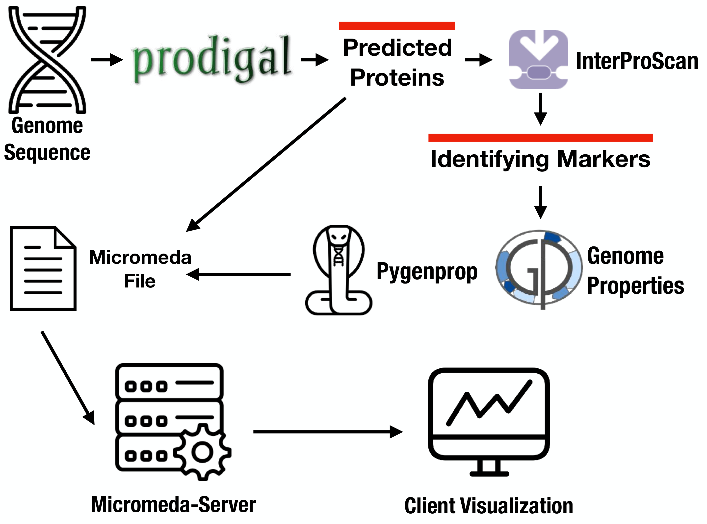

Micromeda Platform
==================

Overview
--------

The Micromeda platform allows users to predict which genome properties are possessed by organisms and then compare the presence and absence of these properties across organisms. The platform three core components:

- **Micromeda-Visualizer** -- A web-based visualization tool that draws interactive heat maps of genome property and property step assignments. It has two components Micromeda-Client and Micromeda-Server and is available at BlahBlahBlah.
- **Pygenprop** -- A Jupyter Notebooks compatible python library that allows for the programmatic comparison of property and step assignments across organisms. Pygenprop also allows users to explore the InterProScan annotations and protein sequences that support genome property assignments. Pygenprop also possesses a command line interface (CLI) for generating **Micromeda files**.
- **Micromeda Files** -- These files allow for the aggregation and transfer of genome property assignments, step assignments, and supporting InterProScan annotations and protein sequences from multiple organisms. They allow for transfer of complete property analysis datasets between researchers. **They are also used to transfer datasets to Micromeda-Visualizer.**

Analysis Workflow
-----------------

Analyzing datasets using Micromeda involves the following steps:

- Acquiring an organism's protein sequences
- Annotating an organism's proteins using InterProScan5
- Creating a Micromeda file using **Pygenprop's** CLI
- Uploading the Micromeda file to **Micromeda-Visualizer**

#### An overview of creating Micromeda files.


Installing Software and Databases
---------------------------------

The following pieces of software must be installed to generate Micromeda files:

- InterProScan5
- Pygenprop

The following pieces of software are used in the tutorial but are optional:

- PRODIGAL
- GNU Parallel

InterProScan5 takes organism's predicted proteins sequences as input. To get these proteins, genes must first be predicted using a gene prediction application (e.g., [https://en.wikipedia.org/wiki/List\_of\_gene\_prediction\_software](https://en.wikipedia.org/wiki/List_of_gene_prediction_software)) and then translated to proteins either using the same software or a second piece of software. Different pieces of software must be used on eukaryotic vs prokaryotic genomes. **For this tutorial its is assumed that prokaryotic organisms are being analyzed. PRODIGAL is used to predict these organism's proteins.**

### Install InterProScan

InterProScan5 can be easily installed using our Docker-based installation.

```shell
docker build https://raw.githubusercontent.com/Micromeda/InterProScan-Docker/master/Dockerfile -t micromeda/interproscan-docker
```

You should also install the our wrapper script that allows you to run InterProScan on files found outside of its container.

```
wget https://raw.githubusercontent.com/Micromeda/InterProScan-Docker/master/run_docker_interproscan.sh
chmod +x run_docker_interproscan.sh
```

### Install Pygenprop

```shell
pip install numpy # Numpy needs to be installed separately
pip install pygenprop
```

### Install Prodigal (optional)
PRODIGAL can either be installed using the authors installation tutorial. Alternatively, PRODIGAL can be installed using Conda.

```shell
conda install -c bioconda prodigal
```

### Install GNU Parallel (optional)

GNU parallel can be used to parallelize some workflows such as gene prediction across multiple processes.

```shell
# Linux
apt-get install parallel

# OSX
brew install parallel 
```

### Download The Genome Properties Database

```shell
wget https://raw.githubusercontent.com/ebi-pf-team/genome-properties/master/flatfiles/genomeProperties.txt
```


Create a Micromeda file for One Organism
------------------------------------------
Below is a tutorial that overviews how to build a **Micromeda file** for a single organism.

### 1. Predict Proteins
Prodigal is used to predict an organisms protein encoded open reading frames.

```shell
prodigal -i ./genome.fasta -a ./genome.faa 
```

### 2. Remove ```*``` Characters
Prodigal adds ```*``` characters, representing stop codons, to the end of its output predicted protein sequences. ```*``` is not in the IUPAC protein alphabet. As a result, InterProScan throws an error when parsing PRODIGAL's output proteins sequences. These ```*``` characters need to be be removed from PRODIGALS output ```.faa``` file.

Sed can be used to remove these ```*``` characters. 

```shell
sed -i '' 's/\*$//' genome.faa
```

### 3. Annotate Domains
The above installed InterProScan5 Docker container can be used to annotate the domains found within the above sanitized ```.faa``` file. For convenience, we can use ```run_docker_interproscan.sh```, which simplifies using the container.

```shell
run_docker_interproscan.sh genome.faa
```

At the moment ```run_docker_interproscan.sh``` simply tacks on the ```.tsv``` file extension *.faa
```shell
rename 's/\.faa//' *.tsv
```


### 4. Build a Micromeda File
When Pygenprop is install it also installs a CLI that can be used to build Micromeda files, among a few other functions. The CLI's ```build``` command takes the previous output TSV file generated by ```run_docker_interproscan.sh```

```shell
pygenprop build -d ./genomeProperties.txt -i genome.tsv -o ./data.micro -p
```

Create a Micromeda file for Multiple Organisms
----------------------------------------------
Many of the steps explained above can can be applied to multiple genomes. Let assume we have the following directory structure:

```
data/
├── ecoli_one.fasta
├── ecoli_two.fasta
```

### 1. Predict Proteins

```shell
find . -name "*.fasta" -maxdepth 0 | parallel prodigal -i {} -a {}.faa
```

```shell
rename 's/\.fasta//' *.faa
```

***Resulting Files***

```
data/
├── ecoli_one.fasta
├── ecoli_one.faa
├── ecoli_two.fasta
├── ecoli_two.faa
```

### 2. Remove Star Characters

```shell
sed -i '' 's/\*$//' *.faa
```

### 3. Annotate Domains
```shell
find . -name "*.faa" -maxdepth 0 | parallel -j 1 run_docker_interproscan.sh {}
```


```shell
rename 's/\.faa//' *.tsv
```

***Resulting Files***

```
data/
├── ecoli_one.fasta
├── ecoli_one.faa
├── ecoli_one.tsv
├── ecoli_two.fasta
├── ecoli_one.tsv
├── ecoli_two.faa
```

### 4. Build a Micromeda File

```shell
pygenprop build -d ./genomeProperties.txt -i *.tsv -o ./data.micro -p
```

***Resulting Files***

```
data/
├── ecoli_one.fasta
├── ecoli_one.faa
├── ecoli_one.tsv
├── ecoli_two.fasta
├── ecoli_one.tsv
├── ecoli_two.faa
├── data.micro
```

Uploading a Micromeda File for Visualization
--------------------------------------------

